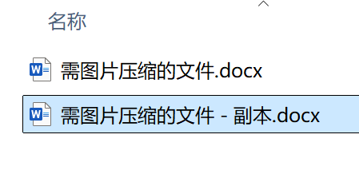
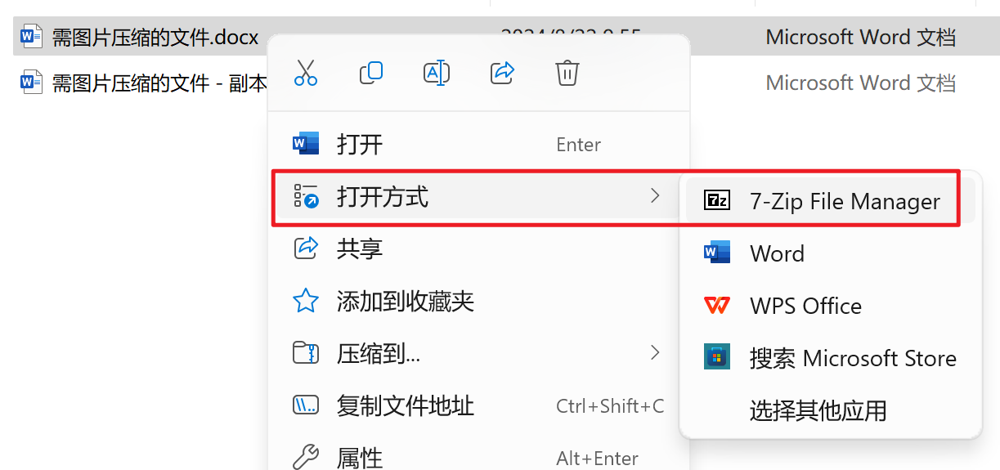
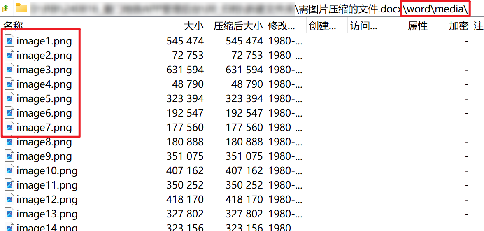
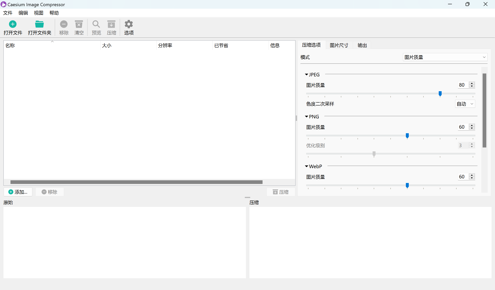
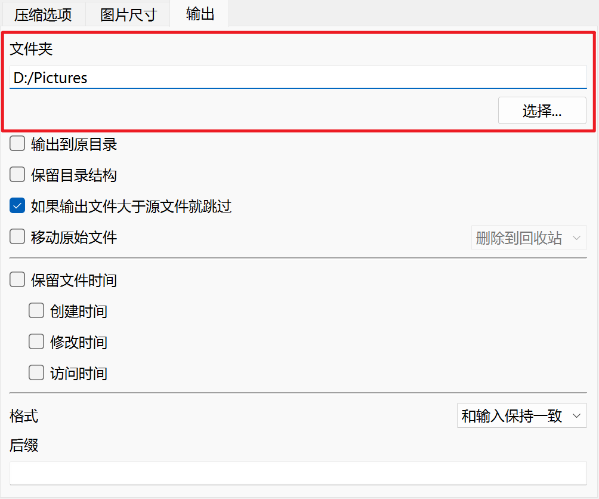
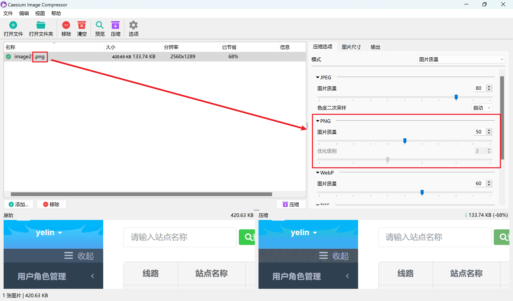
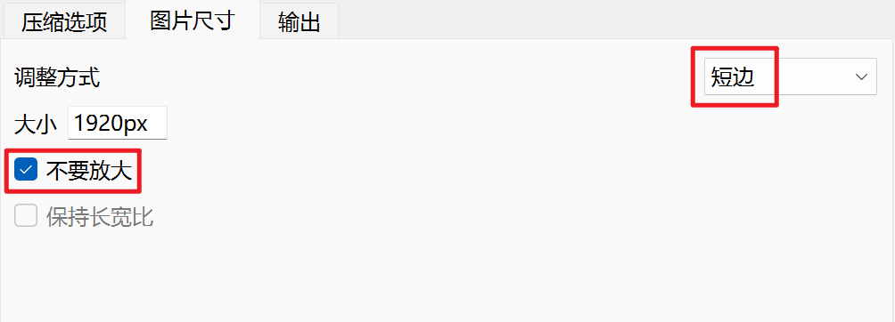
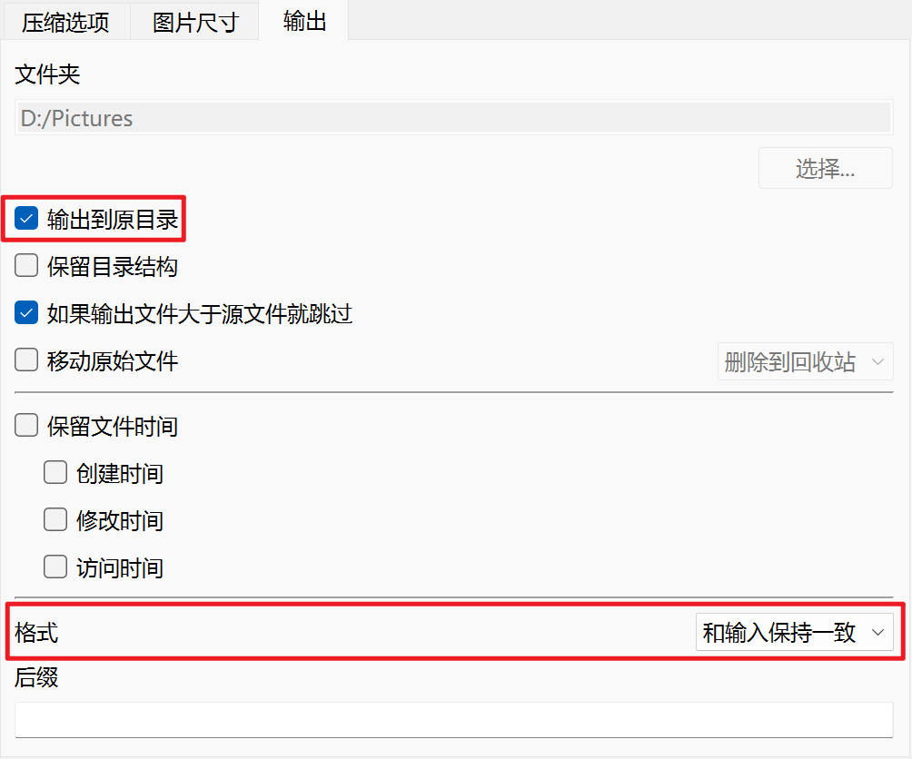
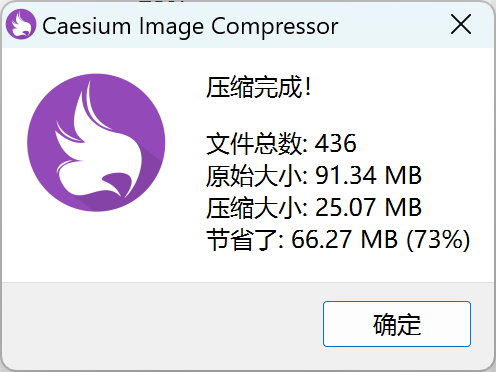
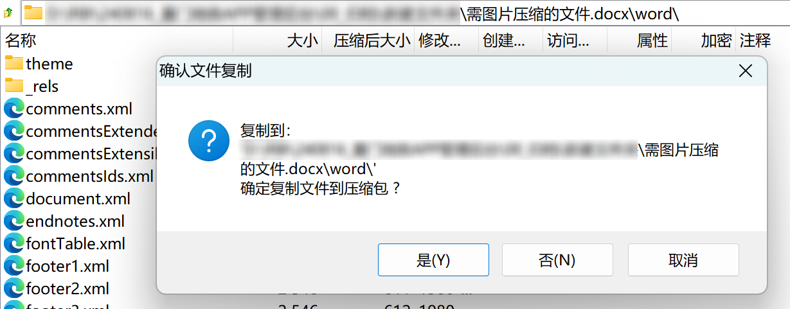

# 图片压缩

## 提取图片

1. 对需图片压缩的文件进行备份。
   
2. 使用任意压缩软件打开文件。
   
3. 进入`./word/media/`文件夹，可以看到许多图片文件。
   
4. 返回上级，将`media`文件夹整体解压到任意位置，等待处理。

## 调整参数

1. 获取软件`Caesium Image Compressor`，下载地址：https://saerasoft.com/caesium/#downloads。
   
2. 点击`打开文件`按钮或直接拖动，添加任意一张图片至软件中。
3. 点击右侧`输出`选项卡，指定任意文件夹作为输出位置。
   
4. 点击右侧`压缩选项`选项卡，根据图片格式尝试多个图片质量值，点击压缩。不断调整参数，取得质量和文件大小的平衡。
   
5. 若对压缩后大小仍不满意，考虑降低图片尺寸。点击右侧`图片尺寸`选项卡，调整图片尺寸缩放策略。
   对于`Word`，常见的情况是使用嵌入图片，则建议采用`短边`作为调整方式，并勾选`不要放大`。
   
   将压缩后的图片插入到`Word`，检查清晰度是否满足要求，不断调整参数，取得质量和文件大小的平衡。

## 批量压缩

1. 点击工具栏中的`清空`，并点击`打开文件夹`，选择**提取图片步骤**保存的`media`文件夹，等待图片导入完成。
   
2. 点击右侧`输出`选项卡，勾选输出到原目录，并确保`格式`选择`和输入保持一致`。
   
3. 点击`压缩`，等待压缩完成，确保压缩大小满足预期要求。
   

## 替换图片

1. 使用任意压缩软件打开需图片压缩的文件，进入`./word/`文件夹。
2. 点击`添加`按钮或直接拖动，将**批量压缩步骤**压缩完成的`media`文件夹添加到压缩包，替代原有的`media`文件夹。
   
3. 保存并退出压缩软件，检查需图片压缩的文件内容是否正确。